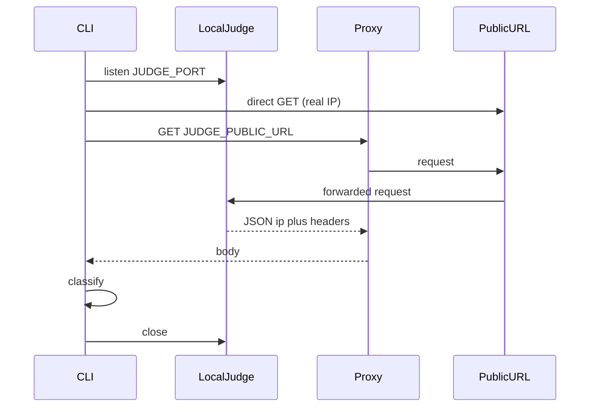

# Architecture

## Pipeline

1. **Collect** — each registered source parser fetches and normalizes proxies into `ProxyRecord[]`.
2. **Merge** — collector deduplicates (`protocol|host:port`), prefers `elite` on anonymity conflicts, optional `--country` filter.
3. **Store** — write `data/proxies/{CC}/{anonymity}-{protocol}.txt` (never writes `data/custom/`).
4. **Check** (optional) — either:
   - **Liveness** — request `--check` URL through each proxy; keep final HTTP **200**
   - **Anonymity (judge)** — if `JUDGE_PUBLIC_URL` / `--judge` is set: start local judge → request public URL through each proxy → classify elite / anonymous / transparent → keep anonymous+elite (rewrite `anonymity` to the measured level)
5. **Store checked** — write `data/checked/{url-slug}/{CC}/{anonymity}-{protocol}.txt`.

## Judge anonymity mode

Config via `.env` (see `.env.example`):

| Variable | Role |
|----------|------|
| `JUDGE_PUBLIC_URL` | Public URL proxies hit (must reach `JUDGE_PORT`) |
| `JUDGE_HOST` / `JUDGE_PORT` | Local bind while the scan runs |
| `JUDGE_TRUST_PROXY` | `1` when tunnel/nginx adds `X-Forwarded-For` |
| `JUDGE_REAL_IP` | Optional; else auto-detected via a direct GET to the public URL |

Classification:

- **transparent** — real IP appears in judge `ip` or headers
- **anonymous** — real IP hidden, but proxy-sign headers remain (`Via`, `X-Forwarded-For`, …)
- **elite** — real IP hidden and no proxy-sign headers
- **dead** — timeout / non-200 / invalid JSON

With `JUDGE_TRUST_PROXY=1`, hop headers from the tunnel are excluded from “proxy signs” so Cloudflare/ngrok do not force every proxy to look anonymous.

## Custom lists

- Path: `data/custom/{CC}/{anonymity}-{protocol}.txt`
- `collect` does not touch this directory
- `--from custom` checks only user lists
- `--input path` adds an arbitrary file/dir for one run

## ProxyRecord

Every source must emit:

| Field | Values |
|-------|--------|
| `host` | IPv4 string |
| `port` | number |
| `country` | ISO2 (`IT`, `US`, …) |
| `anonymity` | `anonymous` \| `elite` |
| `protocol` | `http` \| `https` \| `socks4` \| `socks5` |
| `source` | parser id |

Source-specific raw fields stay inside the parser.

## File naming

`{anonymity}-{protocol}.txt` — e.g. `elite-socks5.txt`, `anonymous-http.txt`.

On spys.me HTTP list, the `S` (SSL) flag maps to protocol `https` (HTTP proxy that supports HTTPS targets). Without `S` → `http`. SOCKS list → `socks5`.

## URL slug

Target URL is sanitized for the filesystem:

- `https://example.com/api` → `https_example_com_api`

## Check timeout

`--timeout` is a **hard wall-clock** limit per proxy (default 10000 ms). Node’s built-in request `timeout` alone does not abort a stuck TCP/SOCKS connect to a dead proxy (the OS can wait 20–30s+). The checker enforces a timer that destroys the request when the deadline is reached. With concurrency, total check time is roughly the slowest in-flight batch, not `N × timeout`.

Agents are created with `keepAlive: false`, sockets are destroyed after each attempt, and the CLI calls `process.exit` when finished so leftover network handles cannot hang the terminal.

Progress lines (`progress: 30/518 completed`) are a **log interval** (every N finished checks). Parallelism is controlled only by `--concurrency`.

Free public lists (spys.me) have a very low live rate; `0/N` against Google is common. Google may also return non-200 (captcha/blocks) even via a live proxy — prefer a neutral target like `https://httpbin.org/status/200` to validate the checker, or use judge mode against your own endpoint.

## Extensibility

- Parsers live in `src/parsers/` and register in `src/parsers/registry.js`.
- Collector, storage, and checker depend only on `ProxyRecord`, not on HTML/API details of a site.
- CLI `--source` selects one or more parsers; omit to use all.

## Modules

| File | Role |
|------|------|
| `src/cli.js` | Commands and flags |
| `src/collector.js` | Run parsers → merge → write |
| `src/checker.js` | Concurrent proxy checks (liveness + judge) |
| `src/env.js` | `.env` loader and judge config |
| `src/judge/server.js` | Short-lived local judge HTTP server |
| `src/judge/classify.js` | elite / anonymous / transparent classification |
| `src/storage.js` | Paths, dedupe, read/write lists |
| `src/types.js` | Shared constants / helpers |
| `src/parsers/registry.js` | Source registry |
| `src/parsers/spysMe.js` | First source adapter |
| `src/parsers/proxyFreeOnly.js` | proxyfreeonly.com API adapter |
| `src/parsers/geonix.js` | free.geonix.com API adapter |
